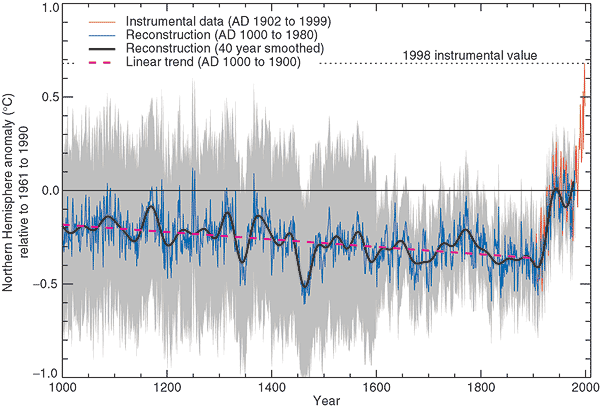
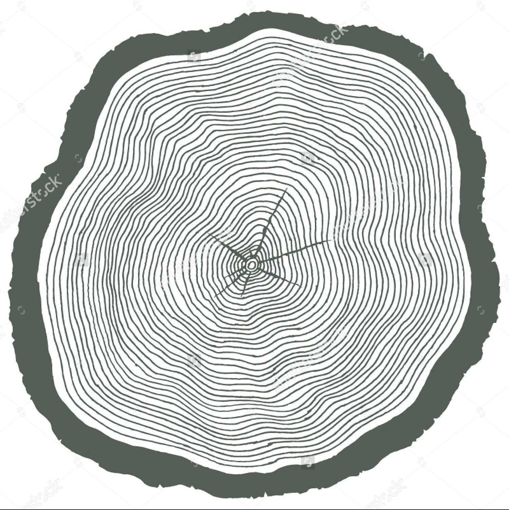
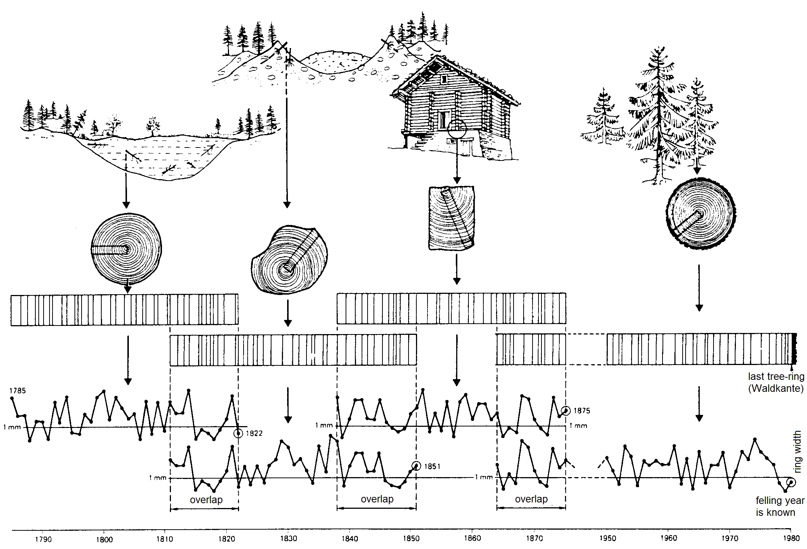
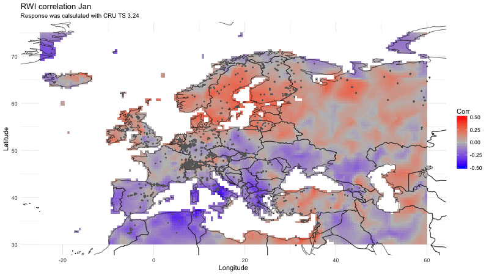

```{r setup, include=FALSE}
#--/ All the inicial settings and data loading
knitr::opts_chunk$set(echo = FALSE)

#--/ Load Libraries, Data and set settings
pacman::p_load(tidyverse, leaflet, gganimate, broom, dplR, FRK, plotly, treeclim)
load('data.Rdata')

```


## Temperature Anomaly
```{r anomaly, fig.show = "animate", echo=FALSE, message=FALSE, warning=FALSE}
temp.anom <- temp_anomaly %>%
  #filter(Year %in% seq(1900, 2000, 10)) %>%
  ggplot(aes(Months, Anomaly, color = Year, group = Year, 
             frame = Year, cumulative=TRUE)) +
  geom_hline(yintercept = 0, color = 'grey50') +
  geom_line() +
  scale_color_gradientn(colours=c("grey","blue","red")) + 
  scale_y_continuous(limits=c(-3, 3)) +
  theme_bw()+
  theme(panel.grid.major=element_blank(),
        panel.grid.minor=element_blank()) +
  labs(title = 'Temperature Anomaly °C',
       subtitle = "(Difference from 1980-2015 annual mean)",
       x = '', y = 'Anomaly')
# save image and load it take less space and work faster
gganimate(temp.anom, "figures/anomaly.gif", ani.width=800, ani.height=450, interval=0.1)
```
```{r, out.width = "800px", out.height = "450px", fig.align='center'}
knitr::include_graphics("figures/anomaly.gif")
```
Data available at [Giss NASA](https://data.giss.nasa.gov/)


## Climate change
```{r, out.width = "800px", out.height = "450px", fig.align='center',}

```
Source: [IPCC](http://www.ipcc.ch)


## Tree rings
```{r, out.width = "450px", fig.align='center'}

```
Source: [stutterstock](https://image.shutterstock.com)


## Tree Ring Width Series
```{r trw, out.width = "800px", out.height = "450px", fig.align='center', echo=FALSE, message=FALSE, warning=FALSE}
detrend.g <- trwd %>%
  filter(treeid %in% 'CAM011') %>%
  ggplot(aes(x = year, y = trw))+
  geom_line(color = 'grey50') +
  theme_bw() +
  labs(title = 'Tree-ring width series',
       x = 'Calendar Year', y = 'TRW (mm)') 

  ggplotly(detrend.g)
```


## Long tree-ring time series 
```{r, out.width = "800px", out.height = "450px", fig.align='center',}

```
Source: [Cybis](http://www.cybis.se)


## Detrend Tree Ring Width Series
```{r detrend, out.width = "800px", out.height = "450px", fig.align='center', echo=FALSE, message=FALSE, warning=FALSE}
detrend.g <- trwd %>%
  filter(treeid %in% 'CAM011') %>%
  ggplot(aes(x = year, y = trw))+
  geom_line(color = 'grey50') +
  stat_smooth(method = 'lm', se = FALSE, colour = "black") +
  stat_smooth(method = 'loess', se = FALSE, colour = "red") +
  stat_smooth(method = 'loess', se = FALSE, colour = "orange", span = 0.4) +
  stat_smooth(method = "lm", formula = y ~ x + I(x^2), se = FALSE, colour = "blue")  +
  theme_bw() +
  labs(title = 'Tree-ring width series',
       subtitle = "Colored lines represent different fits",
       x = 'Calendar Year', y = 'TRW (mm)') 

  ggplotly(detrend.g)
```


## Create a mean chronology
```{r meanDetrend, out.width = "800px", out.height = "450px", fig.align='center', echo=FALSE, message=FALSE, warning=FALSE}
sdepth <- function(x){length(x)/10}

meanrwi.g <- trwd %>%
  group_by(treeid) %>%
  do( bind_cols(., detrend.series(.$trw, 
                                  method = c("Spline", 'ModNegExp'),
                                  make.plot = F)) ) %>%
  ggplot(aes(year, Spline, group = treeid)) +
  geom_line(color = 'grey60') +
  stat_summary(fun.y=mean, geom="line", aes(group=1), colour = 'red') +
  stat_summary(fun.y=sdepth, geom="line", aes(group=1), colour = 'blue', linetype = 2) +
  theme_bw() +
  labs(title = 'Tree-ring width indexes',
       subtitle = "Red line represent mean detrended RWI",
       x = 'Calendar Year', y = 'RWI')

 ggplotly(meanrwi.g)
```


## Correlate with Climate
```{r climCor, out.width = "800px", out.height = "450px", fig.align='center', echo=FALSE, message=FALSE, warning=FALSE}
 dc8 <- dcc(norw015, list(norway_prec, norway_temp), 3:9, var_names = c("prec", "temp"))  
 
 plot(dc8) 
```

## Reconstruct Climate
```{r climPred, out.width = "800px", out.height = "450px", fig.align='center', echo=FALSE, message=FALSE, warning=FALSE}
 
skills(dc8, .range(7, "temp")) %>% plot() %>% ggplotly()
```

## International Tree Ring Data Bank
```{r itrdb, out.width = "800px", out.height = "450px", fig.align='center', echo=FALSE, message=FALSE, warning=FALSE}
#--/ Leaflet
map_header <- paste("<table>
                    <tr><td><strong>Site_ID </strong></td><td>",itrdb$sitename,"</td></tr>
                    <tr><td><strong>Contributor </strong></td><td>",itrdb$contributor,"</td></tr>
                    <tr><td><strong>First year </strong></td><td>",itrdb$firstyear,"</td></tr>
                    <tr><td><strong>Last year </strong></td><td>",itrdb$lastyear,"</td></tr>
                    </table>", sep="")
mpal <- colorNumeric('Blues', itrdb$firstyear)

itrdb  %>%
  leaflet() %>%
  addProviderTiles('Esri.WorldTopoMap') %>%
  addCircles(~lon,
             ~lat, 
             opacity = 1, fillOpacity = 1, 
             fillColor = ~mpal(firstyear), color = ~mpal(firstyear),
             radius = 2,
             popup =  map_header)
```
Data available at [ITRDB](https://data.noaa.gov/dataset/international-tree-ring-data-bank-itrdb)


## Spatial Correlation
```{r spCorelation, fig.show = "animate", echo=FALSE, message=FALSE, warning=FALSE}
itrdb.map <- itrdb %>%
  mutate(id = 1) %>%
  full_join(data.frame(id = 1, month = month.abb), by = 'id')

world.map <- worldmap %>%
  mutate(id = 1) %>%
  full_join(data.frame(id = 1, month = month.abb), by = 'id')


cor.map <- tcor %>%
  ggplot(aes(frame = month))+
  geom_tile(aes(lon, lat, fill = tcorr)) +
  geom_polygon(data = world.map, aes(long, lat, group = group), fill = NA, color = 'grey10', size = 0.3) +
  geom_point(data = itrdb.map, aes(lon, lat), color = 'grey40', size = 0.5) +
  scale_fill_gradientn('Corr', colours=c("blue",'grey',"red"), na.value = 'white') +
  theme_minimal() +
  labs(title = 'RWI correlation',
       subtitle = "Response was calsulated with CRU TS 3.24",
       x = 'Longitude', y = 'Latitude') +
  coord_cartesian(xlim=c(-25, 60), ylim = c(30, 75))

# save image and load it take less space and work faster
gganimate(cor.map, "figures/cormap.gif", ani.width=800, ani.height=450, interval=2)
```
```{r, out.width = "800px", out.height="450px", fig.align='center'}

```


## Spatial Temperature Reconstruction
```{r spTemperature, out.width = "800px", out.height = "450px",  echo=FALSE, message=FALSE, warning=FALSE}
temp.map <- tanom %>%
  filter(month %in% c('Jun')) %>%
  ggplot()+
  geom_tile(aes(lon, lat, fill = tmp)) +
  scale_fill_gradientn('Temperature', colours=c("blue",'grey',"red"), na.value = 'white') +
  theme_minimal()

ggplotly(temp.map)
```


## Anomaly Animation Code
```{r anomCode, echo=TRUE, eval=FALSE, message=FALSE, warning=FALSE}
temp.anom <- temp_anomaly %>%
  ggplot(aes(Months, Anomaly, color = Year, group = Year, 
             frame = Year, cumulative=TRUE)) +
  geom_hline(yintercept = 0, color = 'grey50') +
  geom_line() +
  scale_color_gradientn(colours=c("grey","blue","red")) + 
  scale_y_continuous(limits=c(-3, 3)) +
  theme_bw()+
  theme(panel.grid.major=element_blank(),
        panel.grid.minor=element_blank()) +
  labs(title = 'Temperature Anomaly °C',
       subtitle = "(Difference from 1980-2015 annual mean)",
       x = '', y = 'Anomaly')

gganimate(temp.anom, ani.width=800, ani.height=450, interval=0.3)
```


## Leaflet Map of ITRDB data
```{r itrdbCode, echo=TRUE, eval=FALSE, message=FALSE, warning=FALSE}
itrdb  %>%
  leaflet() %>%
  addProviderTiles('Esri.WorldTopoMap') %>%
  addCircles(~lon,
             ~lat, 
             opacity = 1, fillOpacity = 1, 
             fillColor = ~mpal(firstyear), color = ~mpal(firstyear),
             radius = 2,
             popup =  map_header)
```


## Spatial Map of World Temperature
```{r tempmapCode, echo=TRUE, eval=FALSE, message=FALSE, warning=FALSE}
temp.map <- tanom %>%
  ggplot()+
  geom_tile(aes(lon, lat, fill = tmp)) +
  scale_fill_gradientn('Temperature', colours=c("blue",'grey',"red"), na.value = 'white') +
  theme_minimal()

ggplotly(temp.map)
```


## Thank You

**Trotsiuk Volodymyr**

```{r, out.width = "450px", fig.align='center'}

```

